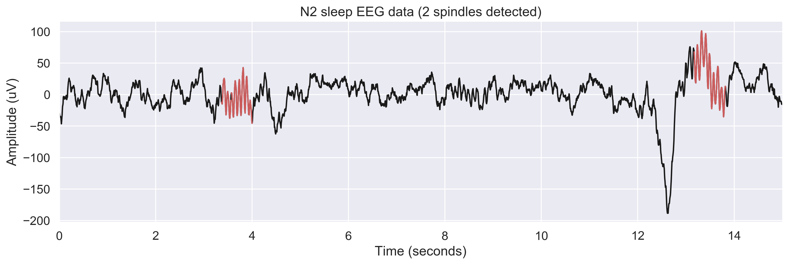

.. -*- mode: rst -*-

|

.. image:: https://badge.fury.io/py/yasa.svg
    :target: https://badge.fury.io/py/yasa

.. image:: https://img.shields.io/badge/python-3.6-blue.svg
    :target: https://www.python.org/downloads/release/python-360/

.. image:: https://img.shields.io/github/license/raphaelvallat/yasa.svg
    :target: https://github.com/raphaelvallat/yasa/blob/master/LICENSE

.. image:: https://travis-ci.org/raphaelvallat/yasa.svg?branch=master
    :target: https://travis-ci.org/raphaelvallat/yasa

.. image:: https://ci.appveyor.com/api/projects/status/4ua0pwy62jhpd9mx?svg=true
    :target: https://ci.appveyor.com/project/raphaelvallat/yasa

.. image:: https://codecov.io/gh/raphaelvallat/yasa/branch/master/graph/badge.svg
    :target: https://codecov.io/gh/raphaelvallat/yasa

.. image:: https://zenodo.org/badge/161560926.svg
   :target: https://zenodo.org/badge/latestdoi/161560926

----------------

YASA
====

YASA (*Yet Another Spindle Algorithm*) is a fast and data-agnostic sleep spindles detection algorithm written in Python 3.

The algorithm behind YASA is largely inspired by the method described in:

Lacourse, K., Delfrate, J., Beaudry, J., Peppard, P., Warby, S.C., 2018. A sleep spindle detection algorithm that emulates human expert spindle scoring. *J. Neurosci. Methods*. https://doi.org/10.1016/j.jneumeth.2018.08.014

Installation
~~~~~~~~~~~~

.. code-block:: shell

  pip install --upgrade yasa

**Dependencies**

- numpy>=1.14
- scipy>=1.1.0
- pandas>=0.23,
- mne>=0.17.0
- numba>=0.39.0
- scikit-learn>=0.20

**Note**

Several functions of YASA are written using `Numba <http://numba.pydata.org/>`_, a just-in-time compiler for Python. This allows to greatly speed up the computation time (typically a few seconds for a full night recording).

Examples
~~~~~~~~

Please refer to `notebooks/spindles_detection.ipynb <notebooks/spindles_detection.ipynb>`_ for an example on how to use YASA as well as a step-by-step description of the algorithm.

Typical use
-----------

.. code-block:: python

  import yasa
  yasa.spindles_detect(data, sf)

The result of the detection is a pandas DataFrame

.. table:: Output
   :widths: auto

=======  =====  ==========  ===========  =====  ==========  ==========  ===========  ==============  ==========
  Start    End    Duration    Amplitude    RMS    AbsPower    RelPower    Frequency    Oscillations    Symmetry
=======  =====  ==========  ===========  =====  ==========  ==========  ===========  ==============  ==========
   3.35   4.03        0.68        81.49  20.17        2.74        0.54        12.82               8        0.67
  13.16  13.86        0.70        99.32  24.19        2.84        0.31        12.23               8        0.35
=======  =====  ==========  ===========  =====  ==========  ==========  ===========  ==============  ==========

which can then be easily used to plot the detected spindles

Interactive visualization with Visbrain
---------------------------------------

YASA can also be used in combination with the `Sleep <http://visbrain.org/sleep.html>`_ module of the `Visbrain visualization suite <http://visbrain.org/index.html>`_. That way, the result of the spindles detection can easily be displayed and checked in an interactive graphical user interface. To do so, load Visbrain using the following python file (make sure to update *'PATH/TO/EEGFILE'*).

.. code-block:: python

  from visbrain.gui import Sleep
  from yasa import spindles_detect

  sl = Sleep(data='PATH/TO/EEGFILE')

  def fcn_spindle(data, sf, time, hypno):
      """Replace Visbrain built-in spindles detection by YASA algorithm.
      See http://visbrain.org/sleep.html#use-your-own-detections-in-sleep
      """
      sp = spindles_detect(data, sf, freq_sp=(11, 16),
                           duration=(0.5, 2), freq_broad=(1, 30),
                           thresh={'rel_pow': 0.2, 'corr': 0.65, 'rms': 1.5})
      return (sp[['Start', 'End']].values * sf).astype(int)

  sl.replace_detections('spindle', fcn_spindle)
  sl.show()

Then navigate to the *Detection* tab and click on *Apply* to run the YASA algorithm on the specified channel.

.. figure::  images/visbrain.PNG
   :align:   center

Outlier rejection
-----------------

YASA incorporates an optional post-processing step to identify and remove pseudo (fake) spindles.
The method is based on a machine-learning algorithm (the `Isolation Forest <https://scikit-learn.org/stable/modules/generated/sklearn.ensemble.IsolationForest.html>`_, implemented in the `scikit-learn <https://scikit-learn.org/stable/index.html>`_ package),
which uses the spindles parameters (e.g. amplitude, duration, frequency, etc) as input features to identify "abnormal" spindles.

To activate this post-processing step, simply use:

.. code-block:: python

  import yasa
  yasa.spindles_detect(data, sf, remove_outliers=True)

As an example, the performance of YASA were compared on a ~8 hours recording in an healthy young adults. As shown below, the initial detection - i.e. without the outlier rejection - returned 840 spindles.
After outlier removal, the number of spindles was down to 710, meaning that 130 spindles were considered outliers and removed from the dataframe.

.. figure::  images/spindles_outlier_rejection.png
   :align:   center

Development
~~~~~~~~~~~

YASA was created and is maintained by `Raphael Vallat <https://raphaelvallat.com>`_. Contributions are more than welcome so feel free to contact me, open an issue or submit a pull request!

To see the code or report a bug, please visit the `GitHub repository <https://github.com/raphaelvallat/yasa>`_.

Note that this program is provided with NO WARRANTY OF ANY KIND.

Citation
~~~~~~~~

To cite YASA, please use the Zenodo DOI:

.. image:: https://zenodo.org/badge/161560926.svg
   :target: https://zenodo.org/badge/latestdoi/161560926
